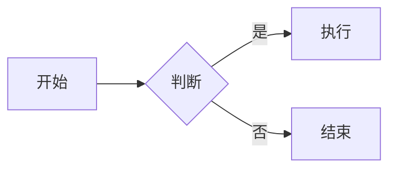

# Markdown 扩展语法

> 部分平台（GitHub、Obsidian、Typora 等）支持的增强语法。使用前留意目标平台是否兼容。

## 脚注

```markdown
这里有一个脚注[^1]。

[^1]: 这是脚注内容。
```

## 高亮

```markdown
==高亮文字==
```

> 注：GitHub 不支持，Obsidian / Typora 支持。

## 上标与下标

```markdown
X^2^      上标 → X²
H~2~O     下标 → H₂O
```

## 数学公式（LaTeX / KaTeX）

- **行内公式**：用单个 `$` 包裹。
- **块级公式**：用两个 `$$` 包裹。

```markdown
行内：$E = mc^2$

块级：
$$
\int_{a}^{b} f(x)\,dx
$$
```

常用符号速查：

| 语法 | 效果 |
|------|------|
| `\frac{a}{b}` | 分数 |
| `\sqrt{x}` | 根号 |
| `x^{2}` / `x_{i}` | 上标 / 下标 |
| `\sum` `\prod` `\int` | 求和 / 求积 / 积分 |
| `\alpha \beta \pi` | 希腊字母 |
| `\leq \geq \neq` | ≤ ≥ ≠ |

## 图表（Mermaid）

用 ` ```mermaid ` 代码块绘制流程图、时序图等：

````markdown

````

常用图类型：
- `graph` / `flowchart`：流程图
- `sequenceDiagram`：时序图
- `gantt`：甘特图
- `classDiagram`：类图

## 折叠内容（HTML）

Markdown 中可直接嵌入 HTML：

```markdown
<details>
<summary>点击展开</summary>

隐藏的内容写在这里。

</details>
```

## 定义列表

```markdown
术语
: 定义内容
```

## 表情符号

```markdown
:smile: :rocket: :+1:
```

> 部分平台（如 GitHub、Obsidian 插件）支持 `:shortcode:` 形式。

## 内嵌 HTML

标准 Markdown 允许直接写 HTML 标签，用于实现原生语法无法表达的效果：

```markdown
<font color="red">红色文字</font>
<br>  强制换行
<kbd>Ctrl</kbd> + <kbd>C</kbd>
```
